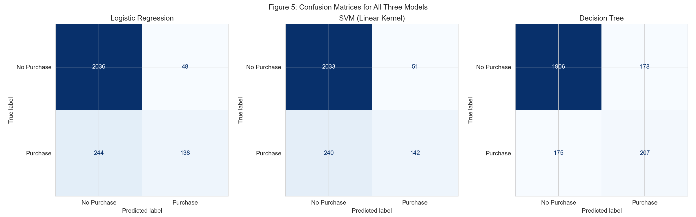
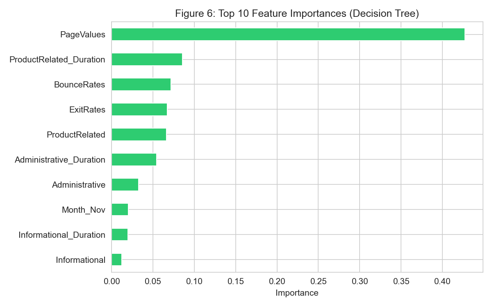

# SmartShop Online: Predicting Purchase Intention

A classification project comparing Logistic Regression, a linear-kernel SVM, and a Decision
Tree to predict, from session-level browsing behaviour, whether an e-commerce visitor will
complete a purchase before leaving the site.

Built by **Gopolang Mmutlwane**.

## The business problem

SmartShop Online is a high-traffic e-commerce retailer with a low conversion rate — most
sessions end without a purchase. The goal is to flag likely purchasers *while they're still
on the site*, early enough for a real-time intervention (a discount, a chat prompt, a product
suggestion) to actually matter.

## What's inside

| File | What it does |
|---|---|
| [`notebooks/purchase_intention_classification.ipynb`](notebooks/purchase_intention_classification.ipynb) | Full pipeline: EDA, correlation and multicollinearity checks, encoding, three models trained and timed, evaluation beyond accuracy, 5-fold cross-validation, and feature importance. |
| [`reports/algorithm_selection_rationale.md`](reports/algorithm_selection_rationale.md) | Why compare all three algorithms rather than pick one upfront — a structured comparison across interpretability, compute cost, scaling requirements, and business fit — plus the POPIA and accountability considerations of using session data for targeting. |
| [`reports/interpretation_and_reflection.md`](reports/interpretation_and_reflection.md) | Business interpretation of the results, the final model recommendation, and an honest reflection on mistakes caught along the way. |
| [`data/`](data) | The Online Shoppers Purchasing Intention dataset (UCI ML Repository) — 12,330 sessions, 18 features, no missing values. |

## Approach

**Class imbalance framed the whole evaluation.** 84.53% of sessions don't convert, so a model
that always predicts "no purchase" already scores ~84.5% accuracy while catching zero buyers.
Precision, recall, and F1 on the purchase class were used throughout instead of accuracy alone.

**Caught my own mistake mid-analysis.** An early draft of the correlation write-up claimed no
predictor pair showed extreme correlation — the heatmap I'd just built showed two pairs at
0.91 and 0.86. Fixed by checking the interpretation against the actual output rather than
taking my first read at face value.

**Cross-validation confirmed the winner wasn't a lucky split.** The Decision Tree beat
Logistic Regression on a single train/test split, but a single split isn't proof. 5-fold
stratified cross-validation confirmed the Decision Tree's F1 advantage held across every fold
(mean F1 0.566, std 0.012) and was more consistent than Logistic Regression's (std 0.027).

## Key results

| Model | Accuracy | Recall (purchase) | F1 (purchase) | Train time |
|---|---|---|---|---|
| Logistic Regression | 88.2% | 0.361 | 0.486 | 0.146s |
| SVM (linear kernel) | 88.2% | 0.372 | 0.494 | 4.592s (31.5x slower) |
| **Decision Tree** | 85.4% | **0.542** | **0.540** | **0.122s** |

The two linear models land on nearly identical results — expected, since both fit a straight
decision boundary on the same scaled features. The Decision Tree trades a higher false-positive
count for catching far more real purchasers, which matters here because a missed sale costs
SmartShop Online more than an unnecessary promotional touch.



`PageValues` — the estimated monetary value of a page based on historical completed
transactions — dominates every model: the strongest numeric correlate of purchase (r = 0.49),
the largest Logistic Regression coefficient (1.530), and 42.7% of the Decision Tree's feature
importance. Four independent signals agreeing on the same variable.



**Recommendation:** deploy the Decision Tree. Strongest and most consistent F1 on the class
that matters, fastest to train and predict (useful for frequent retraining), and a feature-
importance story that's more uniformly reliable than Logistic Regression's coefficients (some
of which sit on categories with as few as 10 sessions and shouldn't be trusted). One open
question flagged before deployment: whether `PageValues` is actually available early enough in
a live session to support real-time intervention, or whether it only firms up once a visitor
has effectively already decided to buy.

Full reasoning: [`reports/interpretation_and_reflection.md`](reports/interpretation_and_reflection.md)

## Tech stack

Python · scikit-learn (LogisticRegression, SVC, DecisionTreeClassifier, StratifiedKFold) ·
pandas · matplotlib/seaborn

## Running it

```bash
pip install -r requirements.txt
jupyter notebook notebooks/purchase_intention_classification.ipynb
```

## Notes on the data

This project uses the publicly available **Online Shoppers Purchasing Intention** dataset
(UCI Machine Learning Repository, Sakar et al.) — 12,330 real e-commerce sessions over a
one-year period. "SmartShop Online" is a fictional company used to frame the business context.
